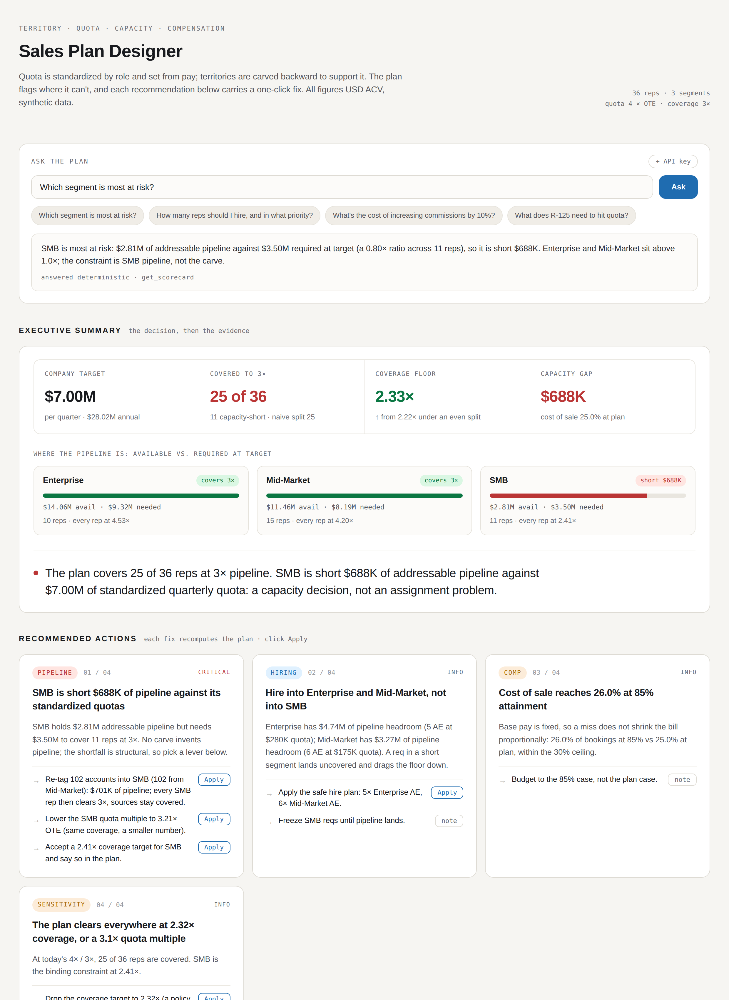

# Sales Plan Designer

**A quota-first sales-plan designer for RevOps: territory, quota, capacity, and
compensation in one model.** It standardizes quota by role,
carves each rep's territory *backward* to support that quota, and flags every seller
whose book can't generate the pipeline to hit their number, **before** the plan
locks and comp letters go out. And it doesn't just diagnose: every finding comes with
a **one-click fix**: re-tag pipeline into a short segment, adjust that segment's
quota, approve or freeze a hire, or tune comp. Applying any of them recomputes the
whole plan.

**[▶ Live demo](https://territory-quota-designer.onrender.com)** &nbsp;·&nbsp; deterministic engine, **all data synthetic** &nbsp;·&nbsp; [what this demonstrates](#what-this-demonstrates) &nbsp;·&nbsp; [how it works](#the-chain-quota-rules)



> **Worked example** (synthetic data): 36 reps, a **$7.0M/quarter ($28M/year)** target.
> The plan covers **25 of 36**: SMB is short **$688K** of pipeline. The tool says so
> plainly, then offers three one-click fixes (re-tag 102 accounts into SMB, lower SMB's
> quota multiple, or accept a lower SMB coverage target), plus a safe hiring plan and a
> cost-of-sale check. Change any assumption and everything recomputes.

## The problem it solves

**For a CRO or Head of Sales Ops.** Most companies set quota by **title**: every
Enterprise AE carries the same number, derived from their pay band, not by the size
of the book in front of them. That's how sales orgs actually run, and it's the core
risk: nothing guarantees a rep's territory holds enough pipeline to produce that
number at the team's real win rates. When it doesn't, the rep is under-covered before
the year starts, attainment slips, cost-of-sale climbs, and the forecast built on
those quotas was optimistic from day one. Usually you find out at the QBR. This tool
finds out **before the plan locks**, quantifies the gap, and proposes the fix.

## What it does

- **Standardizes quota by role, from pay**: same title + segment → same quota,
  derived from OTE (industry-norm 4–6×). No politics, no per-rep guesswork.
- **Carves territories backward** from those fixed quotas to a pipeline-coverage
  target, then runs a **reverse waterfall** through your real stage win-rates to prove
  each book can actually produce its number.
- **Surfaces the gap honestly**: a per-rep coverage ratio and an explicit dollar
  shortfall for every under-covered territory, instead of hiding it in an uneven carve.
- **Recommends the fix, one click**: re-tag pipeline into a short segment (a real
  account move, verified to lift *every* rep over the line), lower that segment's quota,
  accept a lower coverage target, apply a safe hiring plan, or auto-tune comp to a
  cost-of-sale ceiling. Applying any lever recomputes the whole plan.
- **Prices the plan**: total comp, cost-of-sale, and how both move across attainment
  scenarios.

## What this demonstrates

A compact but complete slice of building a decision tool on top of a real domain model:

- **RevOps / GTM domain modeling**: quota policy, capacity planning, reverse-waterfall
  funnel math, comp design and cost-of-sale, hiring capacity.
- **A deterministic, tested engine**: every number the UI shows comes from pure Python
  in `core/` (93 unit tests, `ruff` + `black` clean); a fixed seed reproduces the plan.
- **Recommendations that resolve, not just report**: each fix is computed *and* returned
  as an applyable settings delta, with round-trip tests proving it clears the issue it
  targets (the re-tag lever even re-carves until *every* rep clears).
- **An AI/agent layer, human-in-the-loop**: the same engine is an **MCP server** (15
  read-only tools) an LLM can drive to interrogate and fix a plan; the model only
  *explains and proposes*, the deterministic core owns every number.
- **Full-stack, and shipped**: FastAPI backend, a self-contained interactive dashboard,
  CI-quality checks, and a live deploy on Render.

**Tech:** Python · FastAPI · pydantic · pytest · Model Context Protocol · vanilla-JS
dashboard · Render. The optional narrative layer uses the Anthropic API and degrades
cleanly with no key. All data is synthetic (`generate_territory_data.py`), no real
customer or company data, ever.

**Units.** Every dollar figure is **USD ACV**; OTE is annual, the **annual** quota is
4–6× OTE, and the per-rep **quarterly** quota shown is that ÷ 4. Coverage is a ratio,
so denomination never changes an outcome.

## The chain (quota rules)

```
OTE by role  →  ① Quota    standardized per role: annual quota = multiple × OTE, shown quarterly (same role → same number)
             →  ② Carve    work back from quota: pack each book to a pipeline-coverage target (3×)
             →  ③ Waterfall reverse-funnel adequacy on the packed pipeline (a second lens)
             →  ④ Comp      OTE-anchored payouts, cost-of-sale, attainment scenarios
```

The inversion from the usual "balance books → derive proportional quota → hope the
pipeline's there" is the point: **quota is the fixed input**, and the territory is
what you build to support it.

## Quickstart

```bash
pip install -r requirements.txt      # or: make install
make data                            # regenerate data/ (seed 42), optional, it's committed
make test                            # pytest, the engine is fully unit-tested
make plan                            # print the capacity scorecard
make api                             # FastAPI on $PORT (default 8000); root serves the dashboard
```

Everything runs offline. To enable the optional explanations, set
`ANTHROPIC_API_KEY` (and `pip install anthropic`); without it the app runs end to
end and `/explain` returns a clear "narrative disabled" message.

## Standardized quota by role, anchored on pay

Two reps with the same title and segment carry the **same quota**: anything else
destroys morale and breaks the comp/CAC model. A "role" is `segment × seniority
level`, and quota is derived backward from on-target earnings:

```
OTE(role)    = SEGMENT_OTE[segment] × LEVEL_OTE_FACTOR[level]   (annual OTE, editable per role)
annual quota = QUOTA_TO_OTE × OTE                               (default 4×; industry norm 4–6×)
quota        = annual quota ÷ 4                                 (the quarterly target the model plans on)
company target = Σ every rep's quarterly quota                 (derived, not handed down)
```

OTE is sized for a US SaaS company of ~$100–500M revenue; the default roster
(annual quota = 4 × OTE, shown quarterly):

| Role | OTE (annual) | Annual quota (4×) | Quarterly quota |
| --- | ---: | ---: | ---: |
| Enterprise · Sr. Strategic AE | $420K | $1.68M | **$420K** |
| Enterprise · AE | $280K | $1.12M | **$280K** |
| Enterprise · ramping | $224K | $896K | **$224K** |
| Mid-Market · Sr. AE | $219K | $875K | **$219K** |
| Mid-Market · AE | $175K | $700K | **$175K** |
| Mid-Market · ramping | $140K | $560K | **$140K** |
| SMB · AE | $110K | $440K | **$110K** |
| SMB · ramping | $88K | $352K | **$88K** |

Company target ≈ **$7.0M/quarter** ($28M annual), the sum of the 36-rep team's
quarterly quotas. Edit any role's OTE or the multiple in the dashboard and every rep
in that role, plus the target, moves.

## Work-back carve + the capacity scorecard

Given the fixed quotas, the carve is a capacity-planning problem: pack each book
with **addressable pipeline (whitespace + open) ≥ 3× quota**, respecting segment
focus, preferring the rep's home region as a tiebreaker. When a segment is short,
the carve spreads the shortfall **evenly** rather than starving one rep to over-fill
another, so it raises the worst-covered rep's floor.

The scorecard runs the work-back carve against a naive equal-account split under
the **same** standardized quotas:

| Metric | Naive equal-split | Work-back carve | (target 3×) |
| --- | ---: | ---: | ---: |
| **Total capacity gap** (pipeline short, USD) | $688,000 | **$688,000** | structural |
| **Coverage floor**: worst-covered rep (higher = fairer) | 2.22× | **2.33×** | +5.0% |
| Reps covered to 3× pipeline (of 36) | 25 | 25 | evenly-spread shortfall |
| Off-home-region share (lower = compact) | 0.72 | **0.26** | −63.2% |

The total gap is **identical** between the two carves, and that's the honest point:
SMB is short by $688K no matter how you slice it, so no assignment can beat it on the
total. What the work-back carve *does* is refuse to rob Peter to pay Paul: it spreads
the shortfall evenly instead of starving one SMB rep to over-fill another, which lifts
the **worst-covered rep's floor** (2.22× → 2.33×) and keeps books compact (off-home
−63.2%). The gap that remains is structural:

```
Per-segment pipeline vs. required at 3×:
  Enterprise   $14.06M available   vs   $9.32M required   → OK
  Mid-Market   $11.46M available   vs   $8.19M required   → OK
  SMB           $2.81M available   vs   $3.50M required   → SHORT by $0.69M
```

SMB simply doesn't hold enough pipeline to cover its standardized quotas to 3×.
No assignment can invent pipeline: the fix is to reassign pipeline in, lower the
SMB role's quota (OTE or the multiple), or source more. That's the decision the
tool exists to surface.

## Recommended actions: resolve, not just diagnose

The dashboard's **executive summary** turns the scorecard into a decision (a verdict
plus four tiles), and **Recommended actions** turns each finding into a fix you can
apply in one click. Every lever is computed by `core/recommend.py` and carries an
applyable settings delta, same engine, nothing invented in the UI:

| Finding | Levers (each an **Apply**) |
| --- | --- |
| **SMB short $688K** | re-tag **102 Mid-Market accounts** into SMB ($701K, every SMB rep then clears 3×, sources stay covered) · lower the SMB multiple to **3.21×** · accept a **2.41×** SMB target |
| **Hiring capacity** | apply the safe plan, **5 Enterprise + 6 Mid-Market AE**, freeze SMB |
| **Comp at 85%** | auto-tune the decelerator/base to hold cost-of-sale under a ceiling (a no-op at the default 26%) |
| **Sensitivity** | drop to a **2.32×** global target, or a **3.1×** multiple, and every rep clears |

"Re-tag" is a **true account move**: the tool picks the smallest-addressable
surplus-segment accounts, changes their segment, and re-carves. It keeps moving
accounts, **re-carving to verify at each step, until every target-segment rep clears the
target** (not just the segment aggregate), while the source stays covered and no quota
moves. Applying a lever merges its delta into the settings and recomputes, and an
**Undo** bar lets you roll back the last apply (or several) in one click; an agent gets
the identical fixes via `recommend_actions`. The deterministic levers always recompute on
every change; add an **Anthropic API key** and a **Refresh with AI** button re-reads the
current plan for a prioritized take that reflects whatever you changed (conversion rates,
hires, any knob) while the engine still owns every number.

## Ask the plan in plain English

At the top of the dashboard is an **Ask** box. Type a question and it answers from the
same engine the rest of the tool uses, over whatever settings are currently applied:

- *"What will R-125 need to hit quota?"* returns the rep's pipeline gap and the same-role fixes.
- *"Which segment is most at risk?"* ranks the segments by pipeline vs. required.
- *"How many reps should I hire, and in what priority?"* returns the safe hire plan and what to freeze.
- *"What's the cost of increasing commissions by 10%?"* prices the change against on-target variable pay.

**No API key required.** A deterministic router (`core/ask.py`) maps recognized questions
straight to the engine's own functions and returns real, grounded numbers, so the demo works
offline and every figure is auditable (each answer shows which function produced it). Add an
**Anthropic API key** (top-right of the Ask box, used per-question and never stored on the
server) and free-form questions route to a small Claude agent that calls the same functions as
tools. The model picks tools and narrates; the deterministic core still owns every number.

## Plan hires against capacity

The roster in the dashboard is **editable**: add a rep (a name, or **"TBH"** for an
open req) at any segment and level, and the whole chain recomputes with them in it.
Each hire takes its role's standardized quota, and the carve pulls pipeline from that
hire's segment, so the scorecard shows immediately whether the larger team still covers:

- **Add an Enterprise AE** → the segment's surplus absorbs it: reps-covered goes 25 → 26
  and Enterprise required rises $9.32M → $10.16M but still sits under its $14.06M available,
  a **safe hire**.
- **Add two SMB AEs** → the already-short SMB segment's required jumps $3.50M → $4.16M
  against the same $2.81M available, the new reps land uncovered, and the coverage floor
  drops 2.33× → 1.95×, a hire the segment **can't support without more pipeline**.

That's the question the feature answers: *which levels can I hire into without pushing a
segment below the coverage target.* Over MCP, `whatif_hire(segment, level, count)` returns
the same diff (company target, reps covered, coverage floor, segment pipeline vs. required).

## Worked example (two reps)

```
R-101 · Enterprise · Sr. Strategic AE          R-125 · SMB · AE
  OTE  (annual)         $420,000                  OTE  (annual)         $110,000
  annual quota = 4×OTE  $1,680,000                annual quota = 4×OTE  $440,000
  quarterly quota       $420,000                  quarterly quota       $110,000
  pipeline packed       $1,908,400                pipeline packed       $272,800
  pipeline coverage  1,908,400 / 420,000          pipeline coverage   272,800 / 110,000
                     = 4.54×   (≥ 3×  ✓)                              = 2.48×   (< 3×  ⚠)
  capacity gap        none                         capacity gap        $57,200 short of 3×
```

Same-role reps get the identical quota; the carve packs Enterprise books past 3×
(surplus pipeline) but can only reach ~2.48× for SMB AEs, the SMB segment is
capacity-constrained. A second lens, the **reverse waterfall**, works the quota
back up the funnel (won deals → negotiation → … → required SQLs) to sanity-check
the packed pipeline against stage win-rates; the dashboard shows both.

## The override hierarchy (conversion rates)

Every conversion rate and average deal size the waterfall reads resolves as
`rep > segment > global default (conversions.csv)`, and the engine records *which
tier* supplied each number so the drill-in can show the audit trail:

```json
{
  "global":  {"Negotiation->Won": 0.28},
  "segment": {"Enterprise": {"Negotiation->Won": 0.25}},
  "rep":     {"R-105": {"avg_deal_size": 90000}}
}
```

"If enterprise win-rates drop to 25%, whose funnel breaks?" is exactly this.

## Compensation (OTE-anchored)

Pay is anchored on the **same OTE** that sets quota, so the two are always
consistent:

```
base            = split × OTE                       (fixed, annual)
target_variable = (1 − split) × OTE                 (earned in full at 100% attainment)
variable(att)   = target_variable × payout_factor(att)   (3-band curve, normalized to 1.0 on-target)
total_comp      = base + variable(att)                   (annual)
cost_of_sale    = Σ total_comp / Σ annual bookings       (both annual; ≈ 25% at plan)
```

Comp and bookings are **annual** (OTE is annual, and bookings = quarterly quota ×
4 × attainment), so cost-of-sale lands at the usual ~20–30% rather than a quarter-
vs-year mismatch. `payout_factor` is a piecewise-linear multiplier normalized so
on-target pays exactly the target variable: a **decelerator** below a floor (reduced
slope), the standard slope up to target, and an **accelerator** above it, with an
optional cap. All parameters are editable, with a live payout curve. Because the
accelerator lifts variable faster than bookings, cost-of-sale can tick *up* above
100% attainment, which the tool shows honestly.

## API

Data is loaded once at startup; each endpoint recomputes from a settings payload.
Interactive docs at `/docs`.

| Endpoint | Purpose |
| --- | --- |
| `GET /` | the **interactive dashboard**: executive summary + recommended actions (one-click Apply) over the config |
| `GET /api` · `GET /health` | JSON service index · liveness probe |
| `GET /roles` | default OTE + standardized quota per role (seeds the OTE panel) |
| `GET /conversions` · `GET /comp/defaults` | per-segment rate defaults · comp params |
| `POST /balance` | Stage 1: the work-back carve + per-segment capacity |
| `POST /quota` | Stage 2: standardized quota by role (from OTE) |
| `POST /waterfall` | Stage 3: reverse-waterfall coverage roll-up |
| `POST /comp` | Stage 4: payouts, cost-of-sale, scenarios, payout curve |
| `POST /plan` | the whole chain **+ recommendations** in one call (the dashboard's hot path) |
| `GET /territory/{rep_id}` | full single-territory detail (coverage + funnel) |
| `POST /ask` | natural-language Q&A; deterministic router offline, Claude agent with a key |
| `POST /recommend/refresh` | AI re-read of the recommendations for the current settings (needs a key) |
| `POST /explain` | optional LLM rationale; skips cleanly with no API key |

Settings a request can send: `quota_to_ote`, `coverage_target`, `ote_overrides`
(`{segment:{level:ote}}`), `prefer_home_region`, `overrides` (conversions), `comp`,
`attainment`, `added_reps` (`[{name, segment, level}]`, what-if hires),
`segment_overrides` (`{segment:{quota_to_ote?, coverage_target?}}`, per-segment), and
`account_retags` (`{account_id: segment}`, a true re-tag). A recommendation's **Apply**
just merges its delta into these and re-POSTs, no stateful endpoint.

## Agent / MCP

The same engine is an **MCP server** (`mcp_server.py`), fifteen read-only tools so an
agent can interrogate *and resolve* a plan conversationally: `plan_summary`,
`list_territories`, `assess_territory`, `coverage_gaps`, `recommend_actions`,
`whatif_ote`, `whatif_hire`, `whatif_segment_override`, `whatif_coverage`,
`whatif_conversions`, `autotune_comp`, `comp_scenario`, `get_scorecard`, `list_reps`,
`list_segments`. `recommend_actions` returns the same applyable fixes the dashboard
shows. See **[EXAMPLES.md](EXAMPLES.md)** for natural-language questions mapped to tools.

```bash
make mcp        # stdio (Claude Desktop / claude mcp)
make mcp-http   # HTTP on $PORT, MCP_AUTH_TOKEN bearer auth (hosted use)
```

**A runnable agent** ships in `agents/ask_agent.py`: it spawns the MCP server over
stdio, discovers the tools, and drives a Claude tool-use loop to answer a question end
to end. It's the same human-in-the-loop split the dashboard's Ask box uses, shown
against a real MCP transport instead of in-process calls:

```bash
export ANTHROPIC_API_KEY=sk-ant-...
python agents/ask_agent.py "how many reps should I hire, and in what priority?"
```

## Configuration

All tunable knobs live in `config.py`: `SEGMENT_OTE` / `LEVEL_OTE_FACTOR` /
`QUOTA_TO_OTE` (annual pay → quota multiple) / `QUOTA_PERIODS_PER_YEAR` (annual →
quarterly), `PIPELINE_COVERAGE_TARGET` (the carve's 3× target), `PREFER_HOME_REGION`,
and the OTE-anchored `COMP` params, or come from the loaded CSVs. Every one is
overridable per API/MCP call.

## Deploy (Render)

`render.yaml` defines two native-Python web services (both bind `0.0.0.0:$PORT`,
both read the committed `data/` CSVs): the FastAPI app (its root serves the
dashboard) and the MCP server over bearer-auth'd HTTP. Pushing to `main` redeploys.

## Project layout

```
generate_territory_data.py   synthetic data generator (curated 36-rep team)
data/                        accounts.csv · reps.csv · conversions.csv
config.py                    all tunable knobs (OTE, quota multiple, coverage target, comp)
core/
  models.py                  Account · Rep · Territory · PlanResult
  potential.py               per-account opportunity + addressable pipeline
  quota.py                   Stage 2: standardized quota by role, from OTE
  balance.py                 Stage 1: work-back coverage carve + naive baseline
  waterfall.py               Stage 3: reverse waterfall + funnel coverage
  comp.py                    Stage 4: OTE-anchored comp
  overrides.py               rep > segment > global conversion-rate resolution
  evaluate.py                capacity scorecard (work-back vs naive)
  recommend.py               recommended actions + applyable fixes (re-tag / overrides / autotune)
  ask.py                     natural-language Ask: deterministic router + Claude agent
  plan.py                    run_plan orchestrator (quota → carve → waterfall → comp)
  views.py                   JSON-safe roll-up views (shared by API + MCP)
api/main.py                  FastAPI app (serves the dashboard + JSON endpoints)
api/static/index.html        self-contained interactive dashboard (served at /)
mcp_server.py                MCP server (read-only tools over core)
agents/ask_agent.py          runnable agent: drives the MCP server to answer a question
tests/                       one file per module + /plan + API + MCP tool tests
```

## Design principles

- **Quota rules; territory is derived.** Standardized by role, anchored on pay,
  carved backward, the inversion is the whole idea.
- **Surface the gap, don't bury it.** When a segment can't cover its quotas, the
  tool says so (and where the pipeline actually is) instead of hiding it.
- **Config over magic numbers.** OTE, the multiple, the coverage target, and comp
  live in `config.py` or the CSVs, all overridable per call.
- **Deterministic, testable core.** A fixed seed → a reproducible plan; every
  number is traceable to an input a planner can verify.
